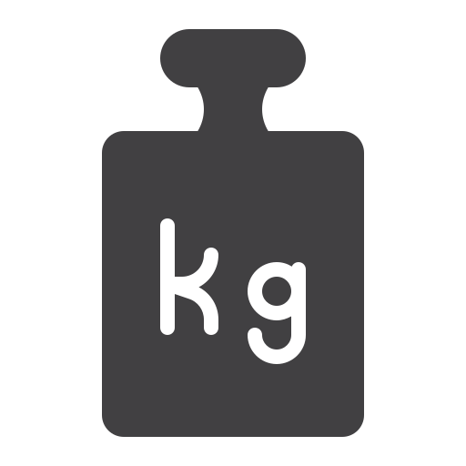
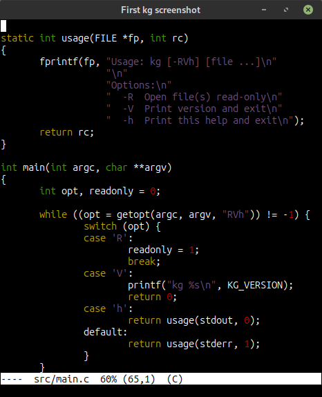

[![2][]][1] [![4][]][3] [![6][]][5] <a href="https://www.flaticon.com/free-icons/kg" title="Kg icons created by alekseyvanin - Flaticon"></a>

# Light Weight UTF-8 Terminal Text Editor

kg is a small, fast terminal text editor with pure Emacs keybindings.
Suitable for editing system files or quick fixes on remote systems where
a full GUI editor is not available.

With syntax highlighting for many languages, multiple buffers, split
windows, incremental search, and multi-level undo, kg punches above its
weight while staying dependency-free — no curses, just standard VT100
escape sequences.

## Features

<a href="doc/screenshot.png"></a>

- Pure Emacs-style keybindings
- Syntax highlighting for many programming languages
- Multiple buffers with shared kill ring
- Split-window support
- Incremental search
- Auto-indent and bracket autocomplete
- Built-in help screen (C-h)
- No dependencies (not even curses)
- Uses standard VT100 escape sequences
- Graceful terminal resize handling

## Usage

```
kg [-RVh] [file ...]
```

| Option | Description                  |
|--------|------------------------------|
| `-R`   | Open file(s) read-only       |
| `-V`   | Print version and exit       |
| `-h`   | Print this help and exit     |

Multiple files can be opened at once, each in its own buffer.  See the
[man page][7] for more in-depth information as well as the full key
binding reference.

## Building and Installing

```bash
make
sudo make install          # installs to /usr/local/bin and /usr/local/share/man/man1
```

Override the prefix or use DESTDIR for staged installs:

```bash
make install prefix=/usr
make install DESTDIR=/tmp/pkg
```

To uninstall:

```bash
sudo make uninstall
```

## Origin & References

kg is based on [kilo][0] by Salvatore Sanfilippo (antirez), the original
minimal text editor that demonstrates how to build a functional editor
without dependencies in about 1000 lines of C code.

The name "kg" is a nod to "mg" (Micro Emacs), suggesting "kilo-gram" - a
minimal implementation with Emacs keybindings.

[0]: https://github.com/antirez/kilo
[1]: https://en.wikipedia.org/wiki/BSD_licenses
[2]: https://img.shields.io/badge/License-BSD%202--Clause-green.svg
[3]: https://github.com/troglobit/kg/actions/workflows/build.yml/
[4]: https://github.com/troglobit/kg/actions/workflows/build.yml/badge.svg
[5]: https://github.com/troglobit/kg/releases
[6]: https://img.shields.io/github/v/release/troglobit/kg?include_prereleases
[7]: https://man.troglobit.com/man1/kg.1.html
